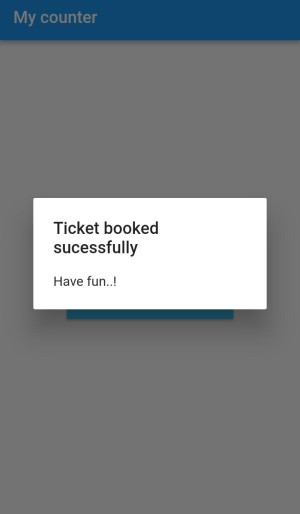

# button

A new demo on how button works.

## check out the code in main.dart file

- _Screenshots_

Before click           |  After click
:-------------------------:|:-------------------------:
 |  