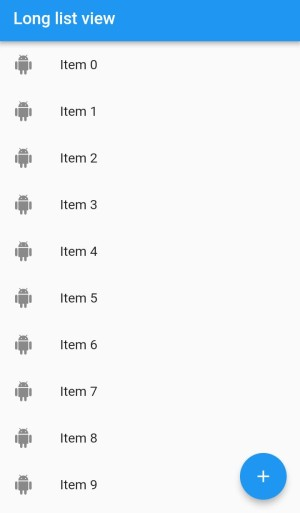
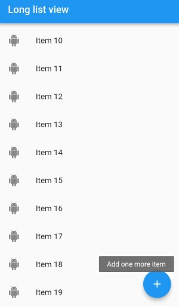

# floating_action_button

A new Flutter project to demonstrate the use of floating action button.

## Get Started

- Add the following code to create floating action button
```
floatingActionButton: FloatingActionButton(
          onPressed:() {
           
          },
            child: Icon(Icons.add),
            tooltip:"Add one more item", //when floating buton is pressed
          
        ),
```

- **NOTE** :floating action button can be added inside scaffold widget

Before click           |  After click
:-----------------------------:|:----------------------------:
     |  