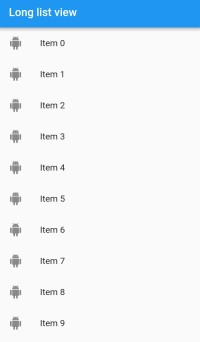

# list_view

A new Flutter project to show how list view works

## Get Started

- Create a list, of String type as shown here
```
List<String>   getListElements(){

  var items = List<String>.generate(1000,  (counter)=>"Item $counter");
  return items;
}
```
- Create a method to that return listview widget
as shown here.
```

Widget getListView(BuildContext context, List<String> items)
{
 var listItems = getListElements();

    var listView = ListView.builder(itemBuilder: (context, index) {
      return ListTile(
        leading: Icon(Icons.android),
        title: Text(listItems[index]),
        onTap: () {
          
        },
      );
    }
  );
    
  var listViews = listView;
  return listViews;
}
```
- To rest of the code look into main.dart file

- Screenshot

