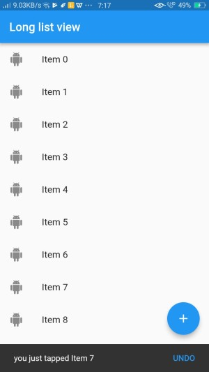

# snackbar

A new Flutter project to demonstrate snackbar

## Get Started

- A piece of code that creates snackbar is here.
```
void showSnackBar(BuildContext context,String items)
{
  var snackbar = SnackBar(
    content: Text("you just tapped $items"),
    action: SnackBarAction(
      label: "UNDO",
      onPressed: ()
      {

      },
    ),
  );
  Scaffold.of(context).showSnackBar(snackbar);
}
```
- On pressing any item snackbar is displayed.
- Here, item 7 is pressed,it is displayed as below:

